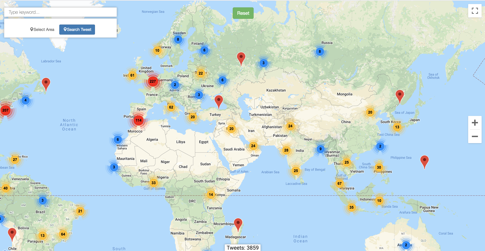

# tweet-map 
[](https://bettercodehub.com/)


This application is capable save Tweets on MongoDb using Twitter API and locates on Google Maps.

Used technologies:

 * mongodb v4.2.3
 * spring-boot v2.2.5-RELEASE
 * twitter4j v4.0.7

### Setup

#### Running MongoDb on Docker

`docker run -p 27017:27017 -v $HOME/docker/volumes/mongo/data:/data --name mongodb -d mongo`

#### Stream filters

Check resources file `tweetFilter.json` and add where you want.

For example:
```
{
    "name": "New York",
    "track": [
      "#covid19",
      "#trump"
    ],
    "coordinate": [
      [74,40],
      [-73,41]
    ]
 }
```
> Bounding Box:
>
> NE numA, numB
>
> SW numC, numD

### Run

`mvn spring-boot:run`

Navigate `localhost:8080`

You can get know more about Twitter Streaming API here:
 * https://developer.twitter.com/en/docs/tweets/filter-realtime/guides/basic-stream-parameters
 
 API
 
 ```
 curl --location --request POST 'http://localhost:8080/api/search/circle' \
   --header 'Content-Type: application/json' \
   --data-raw '{
     "center": {
       "x": 40,
       "y": 20
     },
     "radius": {
       "value": 2,
       "metric": "KILOMETERS"
     }
   }'
```
